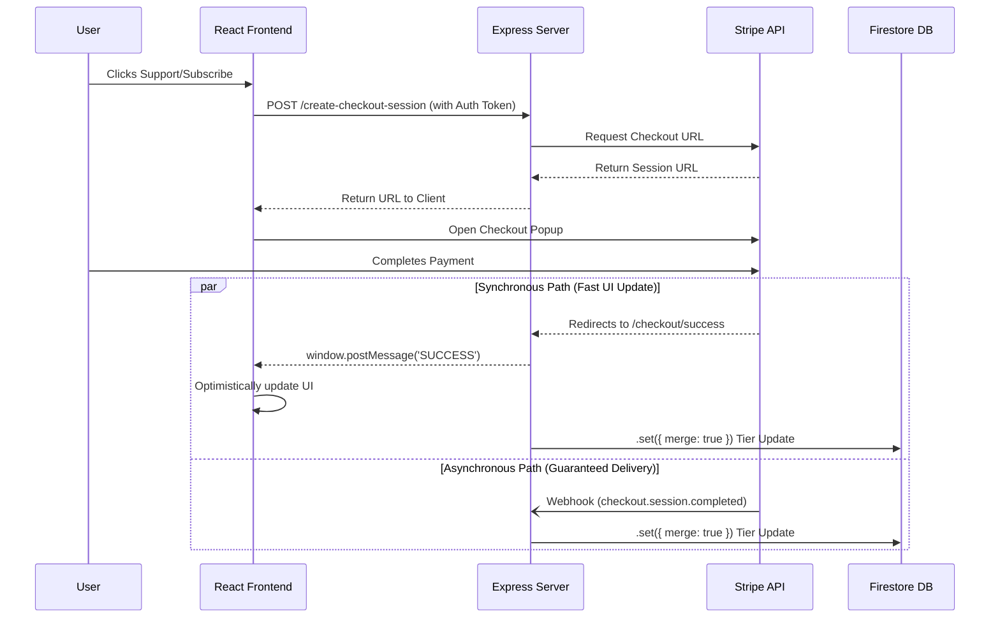

# Integrating Stripe in a Vibe Coding Environment: Tips and Architecture Notes

This document serves as a companion to the video tutorial exploring how to integrate Stripe into a web application built within a "vibe coding" sandbox environment (such as Google AI Studio, CodeSandbox, or StackBlitz). 

*Disclaimer: These are architectural notes and tips based on my personal experience navigating the quirks of sandbox environments and integrating payment gateways. This is not a definitive or "ultimate" guide. Always conduct your own research, review documentation, and perform comprehensive security audits before processing real payments in production.*

---

## 📑 Table of Contents
1. [Architecture Overview](#1-architecture-overview)
2. [The Sandbox Environment Challenge](#2-the-sandbox-environment-challenge)
3. [The Hybrid Sync Approach](#3-the-hybrid-sync-approach)
4. [Cross-Origin Messaging (iframe Fixes)](#4-cross-origin-messaging-iframe-fixes)
5. [Security Considerations](#5-security-considerations)
6. [Database Best Practices](#6-database-best-practices)

---

## 1. Architecture Overview

When building a full-stack application with billing, the architecture generally relies on three core pillars:
1. **The Frontend (React/Vite):** Handles the UI, interacts with Firebase Auth to get user credentials, and triggers the Stripe checkout flow.
2. **The Backend (Express/Node):** Talks directly to Stripe's APIs to generate secure checkout URLs and listens for webhook events to permanently record purchases.
3. **The Database (Firestore):** Stores the source of truth for the user's current subscription status or access tier.

Here is a look at how the data flows during a checkout event:



---

## 2. The Sandbox Environment Challenge

A significant hurdle when developing in browser-based sandboxes is that they are ephemeral. Environment secrets—such as your `FIREBASE_SERVICE_ACCOUNT` JSON key—might not be permanently stored or available during a live preview.

If your backend strictly requires Firebase Admin to initialize, it might crash locally before you can even test the Stripe URL generation. 

### The Environment Adapter (Graceful Degradation)
To solve this, you can write your backend functions to check if the database SDK successfully initialized. If it didn't, gracefully bypass the database write but continue the Stripe flow so you don't block frontend development.

```typescript
// Example from server.ts
const session = await stripe.checkout.sessions.retrieve(sessionId);
const supportTier = session.mode === 'subscription' ? 'monthly' : 'one-time';

if (admin.apps.length > 0) {    
  // Production / Configured Environment: Write securely to the database
  await db.collection('users').doc(uid).set({ supportTier }, { merge: true });
} else {
  // Ephemeral Sandbox: Skip the database write, but keep the server running
  console.warn('Sandbox Mode: Bypassing Firebase Admin database update.');
}

// Proceed to return the frontend success script regardless of database state
res.send(closeWindowHtml('STRIPE_CHECKOUT_SUCCESS', supportTier));
```

---

## 3. The Hybrid Sync Approach

As shown in the architecture diagram, Stripe offers two ways to confirm a payment:
1. **The Webhook:** A background server-to-server POST request. Highly reliable, but cannot reach a local sandbox (e.g., `localhost` or an internal AI Studio preview).
2. **The Redirect URL:** Pointing the user's browser back to an endpoint like `/api/checkout/success` when they finish. 

If you solely rely on webhooks, you cannot easily test your app in a sandbox. If you solely rely on redirects, a user closing their browser tab too early will cause you to lose the purchase record entirely.

**The Tip:** Implement both.
* Design your `/api/checkout/success` redirect to serve as a fast path. When the user lands there locally, they get immediate UI feedback.
* Keep the `/api/webhook` route active for production. Since both routes write the exact same status (`supportTier: "monthly"`), the operations are idempotent and safely back each other up.

---

## 4. Cross-Origin Messaging (iframe Fixes)

If you use `window.open` to launch the Stripe Checkout flow, you'll need the popup to communicate back to your main React window when it finishes. 

However, sandbox previews (like Google AI Studio or CodeSandbox) often run your application inside nested embedded `iframe`s hosted on domains like `aistudio.google.com` or `googleusercontent.com`. 

If your React app strictly listens for messages coming *only* from `localhost`, your browser's security policies will silently drop the success message. You must broaden your `postMessage` listener to accept signals from your sandbox's host domain.

```typescript
// App.tsx
window.addEventListener('message', (event) => {
  const isAllowedOrigin = 
    event.origin === window.location.origin ||
    event.origin.includes('localhost') || 
    event.origin.includes('googleusercontent.com') ||
    event.origin.includes('aistudio.google.com'); // Sandbox host domain
    
  if (!isAllowedOrigin) return; 
  
  if (event.data?.type === 'STRIPE_CHECKOUT_SUCCESS') {
     // Apply optimistic UI update here
     setUser({...user, supportTier: event.data.payload});
  }
});
```

---

## 5. Security Considerations

When writing AI-generated code or following quick-start guides, security validation is often skipped for brevity. **Never trust data sent directly from the client.**

### Protect Sensitive Endpoints (JWT Auth)
If you have an endpoint like `/api/create-portal-session` that generates a Stripe Customer Billing Portal link, do not solely rely on a UID passed in the JSON body:
```json
// INSECURE
{ "uid": "user123_public_id" }
```
Because UIDs are often public or easily guessed, a malicious actor could pass someone else's UID and gain access to their billing portal. 

Instead, have the frontend generate a JSON Web Token (JWT) from Firebase Auth:
```typescript
const token = await auth.currentUser?.getIdToken();
// Send as Header: Authorization: Bearer <token>
```
Your Express backend should mathematically verify this token using `admin.auth().verifyIdToken(token)` to guarantee the request is genuine.

### Validate Pricing Server-Side
If your UI allows a user to pick a $5, $10, or $15 support tier, never pass that raw integer directly to Stripe from the frontend request. Always validate against an accepted list of prices on your Express server, or better yet, map the request to hardcoded Stripe `Price IDs` to prevent attackers from submitting a $0.01 checkout payload.

---

## 6. Database Best Practices

When interacting with Firestore (or any document database) during webhook events, keep these two concepts in mind to prevent silent data corruption:

### Use Merges, Not Updates
When a webhook arrives, you might instinctively use `.update(data)`. However, if the user checks out *so fast* that their initial profile document hasn't been created in the database yet, `.update()` will throw an error and crash the webhook.
* **Tip:** Use `.set(data, { merge: true })`. This updates existing fields but safely creates the document if it happens to be missing.

### Idempotency Checks
In distributed systems, Stripe might occasionally send the exact same webhook event twice. To prevent your database from executing redundant writes and triggering unnecessary state changes:
1. Fetch the user's document first.
2. Check if the incoming `supportTier` and `stripeCustomerId` exactly match what is already in the database.
3. If they match, `return` early and ignore the duplicate event.

---

### Conclusion
By blending optimistic frontend updates with resilient, verified backend architectures, you can build a system that works wonderfully in a constraint-heavy sandbox during development, while remaining genuinely secure when you deploy to production.
