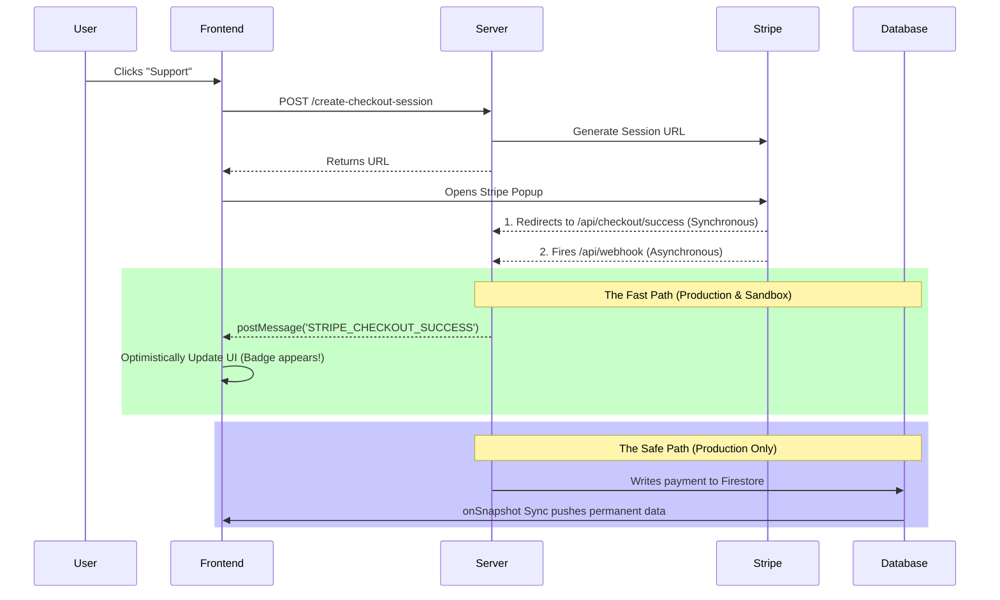

# The Ultimate Guide to Stripe Integration in Vibe Coding Environments (e.g., Google AI Studio)

Welcome! If you are building a modern web application and want to seamlessly monetize it using Stripe, this tutorial is for you. We will focus specifically on how to make Stripe payments work flawlessly inside "Vibe Coding" sandbox environments (like Google AI Studio, CodeSandbox, or StackBlitz), and how to secure your backend with enterprise-grade architectures before launching to production.

---

## 📑 Table of Contents
1. [Introduction: The Sandbox Dilemma](#1-introduction-the-sandbox-dilemma)
2. [Solution 1: The Hybrid Webhook Architecture](#2-solution-1-the-hybrid-webhook-architecture)
3. [Solution 2: The Environment Adapter](#3-solution-2-the-environment-adapter)
4. [Solution 3: Cross-Origin Messaging (Fixing the IFrames)](#4-solution-3-cross-origin-messaging)
5. [Security Audit: Securing the Billing Portal (JWT Auth)](#5-security-audit-securing-the-billing-portal)
6. [Best Practice: Firestore Idempotency & Merging](#6-best-practice-firestore-idempotency--merging)
7. [Best Practice: Subscription Edge Cases](#7-best-practice-subscription-edge-cases)

---

## 1. Introduction: The Sandbox Dilemma
When testing Stripe integrations locally or in a sandbox, you immediately hit two massive roadblocks:
1. **Webhooks Can't Reach You:** Stripe's servers cannot easily send an HTTP POST request to a running sandbox (e.g., a `.run.app` or an internal AI Studio port) to confirm a payment.
2. **Missing Secrets:** Sandboxes often run ephemerally and drop massive environment variables like `FIREBASE_SERVICE_ACCOUNT`, causing backend SDKs to crash when trying to write to databases.

In a normal application, failing either of these steps results in the user checking out, paying money, and your UI failing to give them the premium badge or service they bought.

Let's fix that.

---

## 2. Solution 1: The Hybrid Webhook Architecture
We solve the webhook dilemma by using a **Hybrid Architecture**. This relies on **Optimistic UI** (immediate frontend gratification) and **Guaranteed Delivery** (secure backend websockets).



**Why it works:**
If the webhook fails to reach your sandbox, the synchronous redirect physically forces the user's browser to tell React that the checkout succeeded, rendering the UI instantly. In production, both routes fire perfectly, guaranteeing that the database catches the payment if the user prematurely closes their browser window.

---

## 3. Solution 2: The Environment Adapter
Because ephemeral sandboxes often lack database credentials, we must intentionally program our backend to degrade gracefully rather than crashing. 

**The Wrong Way:**
```typescript
if (admin.apps.length) {
  const session = await stripe.checkout.sessions.retrieve(sessionId);
  // Fails silently in sandbox because Firebase isn't initialized!
}
```

**The Right Way:**
```typescript
const session = await stripe.checkout.sessions.retrieve(sessionId);
const supportTier = session.mode === 'subscription' ? 'monthly' : 'one-time';

if (admin.apps.length) {    
  // 🟢 PRODUCTION: Securely Update Firestore
  await db.collection('users').doc(uid).set({ supportTier }, { merge: true });
} else {
  // 🟡 SANDBOX: Log warning, but STILL pass the tier to the frontend!
  console.warn('Sandbox Mode: Bypassing Firebase update.');
}

// ALWAYS return the tier to the parent popup window
res.send(closeWindowHtml('STRIPE_CHECKOUT_SUCCESS', supportTier));
```

---

## 4. Solution 3: Cross-Origin Messaging
When using a service like Google AI Studio, your code usually runs in an iframe embedded on `https://aistudio.google.com`. 

If your React app tightly restricts `window.postMessage` origins (e.g. `origin === 'localhost'`), the message returning from the Stripe popup gets flagged as a malicious cross-site scripting attempt and silently dropped!

**The Fix:**
Expand your `postMessage` listener to explicitly trust your sandbox preview domains.
```typescript
window.addEventListener('message', (event) => {
  const isAllowed = 
    event.origin === window.location.origin ||
    event.origin.includes('localhost') || 
    event.origin.includes('googleusercontent.com') ||
    event.origin.includes('aistudio.google.com'); // Required for AI Studio share links!
    
  if (!isAllowed) return; // Block malicious sites from hijacking the UI
  
  if (event.data?.type === 'STRIPE_CHECKOUT_SUCCESS') {
     setUser({...user, supportTier: event.data.payload}); // Optimistic Update!
  }
});
```

---

## 5. Security Audit: Securing the Billing Portal
The biggest mistake beginners make in Vibe Coding is trusting the `uid` sent from the frontend.

🚨 **The Exploit:** If your backend reads `{ "uid": "user_123" }` straight from the JSON body to generate a Stripe Billing Portal link, an attacker can simply type in someone else's UID into Postman and download their pre-authenticated Billing Portal link, allowing them to view invoices and cancel subscriptions.

🛡️ **The Fix:** Demand Cryptographic Tokens (JWTs).
1. **Frontend:** Ask Firebase for a token: `await auth.currentUser.getIdToken()`
2. **Frontend:** Pass it in the headers: `'Authorization': 'Bearer ' + token`
3. **Backend:** Cryptographically verify it using Firebase Admin:

```typescript
async function verifyUid(req, res, targetUid) {
  if (!admin.apps.length) return true; // Gracefully bypass only in sandbox mode
  
  const token = req.headers.authorization.split('Bearer ')[1];
  const decoded = await admin.auth().verifyIdToken(token);
  
  if (decoded.uid !== targetUid) throw new Error("Hacker Detected!");
  return true;
}
```

---

## 6. Best Practice: Firestore Idempotency & Merging
When webhooks hit your server, Stripe might occasionally send the exact same event twice during network retries. You must program your database to handle this flawlessly.

* **Never Use `.update()` blindly.** Use `.set(data, { merge: true })`. If a user buys a product before their initial Firebase profile is fully generated, `.update()` will throw a `500 NOT_FOUND` error and crash your server. `.set(..., {merge: true})` gracefully creates the missing document on the fly.
* **Implement Idempotency Checks.** Perform a cheap `.get()` before writing. If the user's `stripeCustomerId` and `supportTier` are exactly identical to the incoming webhook, immediately `return` and exit. Do not write duplicate, redundant operations to your database!

---

## 7. Best Practice: Subscription Edge Cases
Finally, when building out your Stripe webhooks, do not blindly overwrite tiers when subscriptions are altered.

**The "Past Due" Trap:**
If a user's credit card expires, Stripe changes their status to `past_due`. Most tutorials tell you to downgrade the user:
```typescript
if (status !== 'active') { await downgradeUser(); }
```
But what if the user logs in, updates their credit card, and Stripe changes their status *back* to `active`? If your webhook doesn't have an `else if (status === 'active') { await upgradeUser(); }` clause, their account will remain stranded in the downgraded state forever despite paying!

**The Lifetime Erasure Bug:**
If a user buys a $50 "Lifetime" badge, and then later buys a $5 "Monthly" feature, your database will upgrade them to `monthly`. But if they cancel that monthly feature later, your webhook will blindly drop their status to `none`... erasing the $50 lifetime badge they legally own!
* **Tip:** Store `hasLifetimeBadge: boolean` and `isMonthlyActive: boolean` natively in your database, rather than a single `supportTier` variable that gets continuously overwritten.

---

### 🎉 Happy Coding!
By combining optimistic UI states, safely bypassed environment adapters, and strict JWT validation, your code can seamlessly run in a vibe-coding sandbox on Monday and securely scale to ten thousand users in production on Tuesday! 
